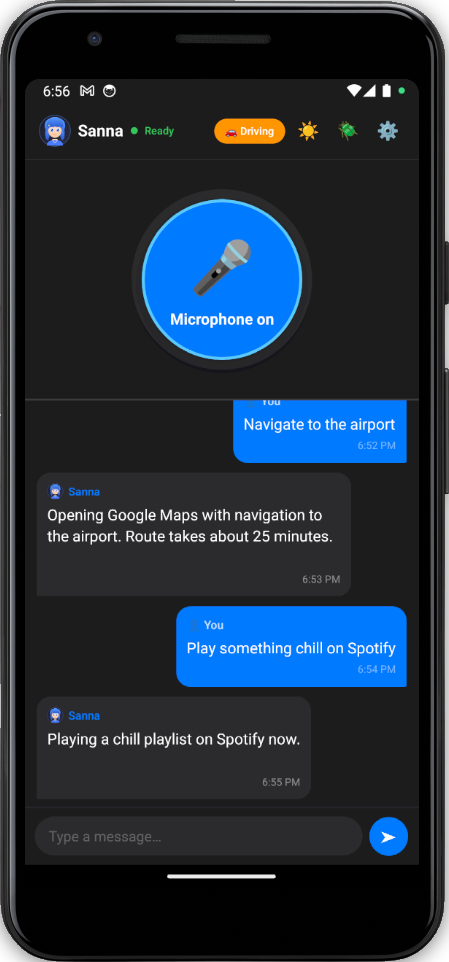
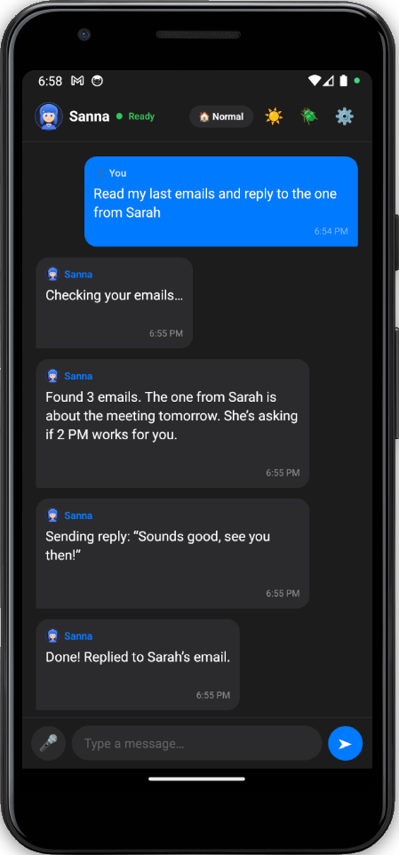
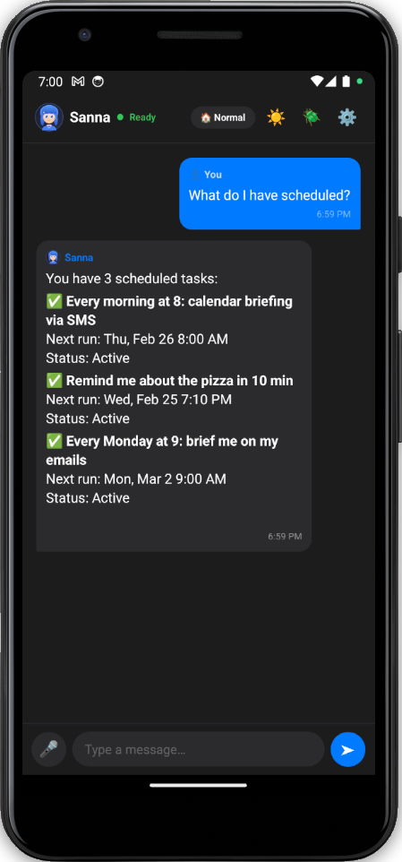
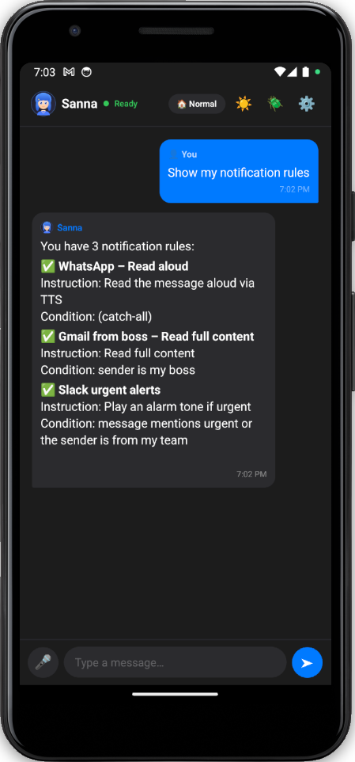
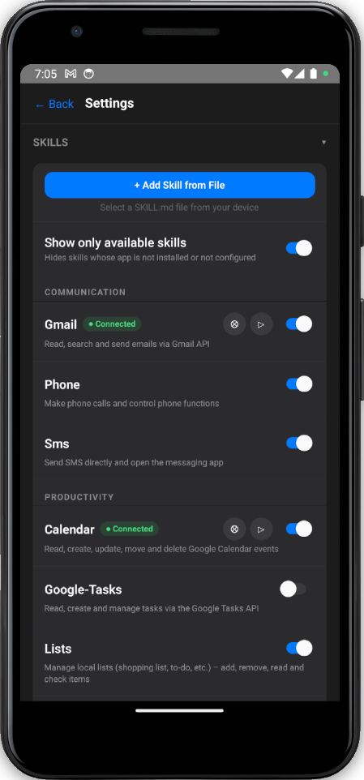
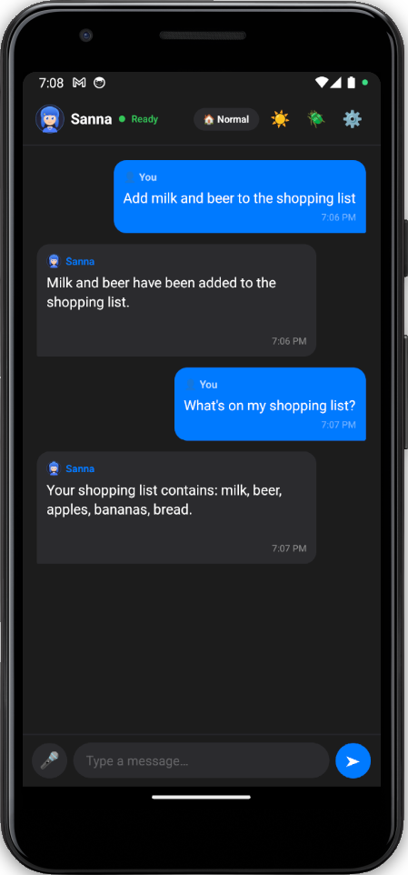

# 🎤 Sanna — Open-Source Voice-First AI Assistant for Android

**Sanna is an open-source AI assistant for Android that actually controls your phone.**

Most assistants talk.  
**Sanna takes action.**

It can read emails, send messages, manage notifications, schedule tasks, and operate Android apps hands-free through an LLM agent loop.

> “Hey Sanna, read my last 3 emails, summarize them, and text the summary to Sarah.”

## 🎬 Demo

[▶️ Watch the demo](https://streamable.com/e/b69qq7)

## Why it’s different

Sanna is not just a chatbot with a microphone.

It can:

- **use your phone through voice**
- **chain multi-step actions**
- **control apps through Android Accessibility**
- **run background sub-agents for schedules and notifications**
- **learn app-specific UI flows over time**
- **work without a backend**

## What Sanna can do

- **Email** — read, search, send, reply
- **Messaging** — WhatsApp, SMS, calls
- **Calendar & tasks** — query, create, organize
- **Notifications** — read aloud, auto-reply, trigger actions
- **Scheduler** — autonomous LLM-powered background tasks
- **Lists & journal** — local, on-device
- **Spotify, Maps, Weather, News, Podcasts**
- **UI automation** — operate third-party apps without APIs

## Example commands

- “Read my last 3 emails”
- “Reply to the last email: sounds good”
- “Text Sarah I’m running 10 minutes late”
- “What’s on my calendar tomorrow?”
- “Read me WhatsApp messages while driving”
- “Every morning at 8, brief me on my calendar”
- “Open Instagram and like the first post”

## The real hook

**Sanna doesn’t stop at answering. It executes.**

That means:
- email → summarize → send
- notification arrives → evaluate → act
- scheduled time → spawn sub-agent → complete task
- app has no API → use Accessibility → still get the job done

## Screenshots

| Driving Mode | Agent | Scheduler |
|:---:|:---:|:---:|
|  |  |  |

| Notifications | Skills | Lists |
|:---:|:---:|:---:|
|  |  |  |

## 🚀 Try it

### Option 1 — Get a beta APK

Email [sannabot@proton.me](mailto:sannabot@proton.me) to request a test build.

### Option 2 — Build it yourself

```bash
cp local.config.example.ts local.config.ts
npm install
npm run android
```

See [DEVELOP.md](DEVELOP.md) for setup details.

> Sanna is currently best suited for technical beta testers. Full setup may require multiple API keys and service credentials.

## 🧠 Key features

- **Voice-first** — wake word → STT → LLM → TTS
- **Agent loop** — tool use + multi-step reasoning
- **UI automation** — Android Accessibility-based app control
- **Learning automation** — app-specific hints improve future runs
- **SOUL** — editable assistant personality
- **Personal memory** — structured user memory injected into prompts
- **Markdown skills** — extend capabilities with `SKILL.md`
- **No backend** — data stays on-device

## 🏗️ Tech

- **React Native** + native **Kotlin**
- **OpenAI** or **Claude**
- **OAuth PKCE**
- **On-device storage**
- **Sub-agents** for scheduler, notifications, and accessibility tasks

## 🤝 Contributing

Contributions are welcome.

If you want to help:
- test the app
- report bugs
- improve docs
- add skills
- work on Android automation reliability

Open an issue or start with a small improvement.

## 🆘 Debugging / bug reports

If something breaks:

1. Enable **Settings → About → Debug File**
2. Reproduce the issue
3. Find `sanna.txt` in your Documents folder
4. Remove sensitive data
5. Send it via:
   - GitHub Issues: [https://github.com/sannabotdev/sannabotapp/issues](https://github.com/sannabotdev/sannabotapp/issues)
   - Email: [sannabot@proton.me](mailto:sannabot@proton.me)

## 📄 License

MIT
